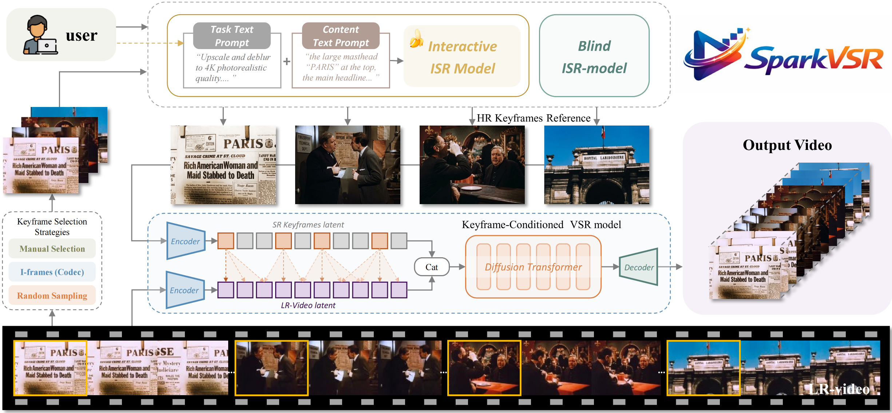
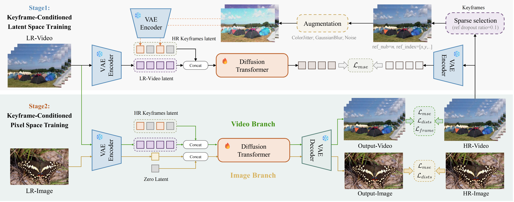

<div align="center">
  <p></p>
  <h1>SparkVSR: Interactive Video Super-Resolution via Sparse Keyframe Propagation</h1>
  <p>
    Jiongze Yu<sup>1</sup>, Xiangbo Gao<sup>1</sup>, Pooja Verlani<sup>2</sup>, Akshay Gadde<sup>2</sup>,
    Yilin Wang<sup>2</sup>, Balu Adsumilli<sup>2</sup>, Zhengzhong Tu<sup>†,1</sup>
  </p>
  <p>
    <sup>1</sup>Texas A&amp;M University &nbsp;&nbsp; <sup>2</sup>YouTube, Google
    <br>
    <sup>†</sup>Corresponding author
  </p>
  <p>
    <a href="https://sparkvsr.github.io/"></a>
    &nbsp;
    <a href="https://huggingface.co/JiongzeYu/SparkVSR"></a>
    &nbsp;
    <a href="https://arxiv.org/abs/2603.16864"></a>
  </p>
</div>

> 💡 **Your ⭐ star means a lot to us and helps support the continuous development of this project!**

#### 📰 News

- **2026.03.17:** This repo is released.🔥🔥🔥

---

### Demo

<p align="center">
  <a href="assets/demo.mp4">
    
  </a>
</p>

---

> **Abstract:** Video Super-Resolution (VSR) aims to restore high-quality video frames from low-resolution (LR) estimates, yet most existing VSR approaches behave like black boxes at inference time: users cannot reliably correct unexpected artifacts, but instead can only accept whatever the model produces. 
In this paper, we propose a novel interactive VSR framework dubbed SparkVSR that makes sparse keyframes a simple and expressive control signal. Specifically, users can first super-resolve or optionally a small set of keyframes using any off-the-shelf image super-resolution (ISR) model, then SparkVSR propagates the keyframe priors to the entire video sequence while remaining grounded by the original LR video motion.
Concretely, we introduce a keyframe-conditioned latent-pixel two-stage training pipeline that fuses LR video latents with sparsely encoded HR keyframe latents to learn robust cross-space propagation and refine perceptual details. At inference time, SparkVSR supports flexible keyframe selection (manual specification, codec I-frame extraction, or random sampling) and a reference-free guidance mechanism that continuously balances keyframe adherence and blind restoration, ensuring robust performance even when reference keyframes are absent or imperfect. Experiments on multiple VSR benchmarks demonstrate improved temporal consistency and strong restoration quality, surpassing baselines by up to 24.6\%, 21.8\%, and 5.6\% on CLIP-IQA, DOVER, and MUSIQ, respectively, enabling controllable, keyframe-driven video super-resolution.
Moreover, we demonstrate that SparkVSR is a generic interactive, keyframe-conditioned video processing framework as it can be applied out of the box to unseen tasks such as old-film restoration and video style transfer.

---

### Inference Pipeline

<p align="center">
  
</p>


---

### Training Pipeline

<p align="center">
  
</p>


## 🔖 TODO

- ✅ Release inference code.
- ✅ Release pre-trained models.
- ✅ Release training code.
- ✅ Release project page.
- ⬜ Release ComfyUI.

## ⚙️ Dependencies

- Python 3.10+
- PyTorch >= 2.5.0
- Diffusers
- Other dependencies (see `requirements.txt`)

```bash
# Clone the github repo and go to the directory
git clone https://github.com/taco-group/SparkVSR
cd SparkVSR

# Create and activate conda environment
conda create -n sparkvsr python=3.10
conda activate sparkvsr

# Install all required dependencies
pip install -r requirements.txt
```


## 📖 Contents

1. [Datasets](#datasets)
1. [Models](#models)
1. [Training](#training)
1. [Inference](#inference)
1. [Citation](#citation)
1. [Acknowledgements](#acknowledgements)

## <a name="datasets"></a>📁 Datasets

### 🗳️ Train Datasets

Our model is trained on the same datasets as [DOVE](https://github.com/zhengchen1999/DOVE): **HQ-VSR** and **DIV2K-HR**. All datasets should be placed in the directory `datasets/train/`.

| Dataset      | Type  | # Videos / Images | Download                                                     |
| ------------ | ----- | ----------------- | ------------------------------------------------------------ |
| **HQ-VSR**   | Video | 2,055             | [Google Drive](https://drive.google.com/file/d/1a4-n8WpV8rJar5qOFJ0GyivhZCv5bCQD/view?usp=sharing) |
| **DIV2K-HR** | Image | 800               | [Official Link](http://data.vision.ee.ethz.ch/cvl/DIV2K/DIV2K_train_HR.zip) |

All datasets should follow this structure:

```shell
datasets/
└── train/
    ├── HQ-VSR/
    └── DIV2K_train_HR/
```


### 🗳️ Test Datasets

We use several real-world and synthetic test datasets for evaluation. All datasets follow a consistent directory structure:

| Dataset |    Type    | # Videos | Average Frames |                           Download                           |
| :------ | :--------: | :---: | :---: | :----------------------------------------------------------: |
| UDM10   | Synthetic  |  10   | 32    | [Google Drive](https://drive.google.com/file/d/1AmGVSCwMm_OFPd3DKgNyTwj0GG2H-tG4/view?usp=drive_link) |
| SPMCS   | Synthetic  |  30   | 32    | [Google Drive](https://drive.google.com/file/d/1b2uktCFPKS-R1fTecWcLFcOnmUFIBNWT/view?usp=drive_link) |
| YouHQ40 | Synthetic  |  40   | 32    | [Google Drive](https://drive.google.com/file/d/1zO23UCStxL3htPJQcDUUnUeMvDrysLTh/view?usp=sharing) |
| RealVSR | Real-world |  50   | 50    | [Google Drive](https://drive.google.com/file/d/1wr4tTiCvQlqdYPeU1dmnjb5KFY4VjGCO/view?usp=drive_link) |
| MovieLQ | Old-movie | 10  | 192  | [Google Drive](TODO) |

Make sure the path (`datasets/test/`) is correct before running inference.

The directory structure is as follows:

```shell
datasets/
└── test/
    └── [DatasetName]/
        ├── GT/         # Ground Truth: folder of high-quality frames (one per clip)
        ├── GT-Video/   # Ground Truth (video version): lossless MKV format
        ├── LQ/         # Low-quality Input: folder of degraded frames (one per clip)
        └── LQ-Video/   # Low-Quality Input (video version): lossless MKV format
```

### 📊 Dataset Preparation (Path Lists)

Before training or testing, you need to generate `.txt` files containing the relative paths of all valid video and image files in your dataset directories. These text lists act as the index for the dataloader during training and inference. Run the following commands:

```bash
# 🔹 Train dataset
python finetune/scripts/prepare_dataset.py --dir datasets/train/HQ-VSR
python finetune/scripts/prepare_dataset.py --dir datasets/train/DIV2K_train_HR

# 🔹 Testing dataset
python finetune/scripts/prepare_dataset.py --dir datasets/test/UDM10/GT-Video
python finetune/scripts/prepare_dataset.py --dir datasets/test/UDM10/LQ-Video
# (You may need to repeat the above for other test datasets as needed)
```


## <a name="models"></a>📦 Models

Our model is built upon the **CogVideoX1.5-5B-I2V** base model. We provide pretrained weights for SparkVSR at different training stages.

| Model Name            |                   Description                    | HuggingFace |
| :-------------------- | :----------------------------------------------: | :---------: |
| CogVideoX1.5-5B-I2V | Base model used for initialization |    [zai-org/CogVideoX1.5-5B-I2V](https://huggingface.co/zai-org/CogVideoX1.5-5B-I2V)     |
| SparkVSR (Stage-1) | SparkVSR Stage-1 trained weights |    [JiongzeYu/SparkVSR-S1](https://huggingface.co/JiongzeYu/SparkVSR-S1)     |
| SparkVSR (Stage-2) | SparkVSR Stage-2 final weights |    [JiongzeYu/SparkVSR](https://huggingface.co/JiongzeYu/SparkVSR)     |

> 💡 **Placement of Models:**
> - Place the base model (`CogVideoX1.5-5B-I2V`) into the `pretrained_weights/` folder.
> - Place the downloaded SparkVSR weights (Stage-1 and Stage-2) into the `checkpoints/` folder.

## <a name="training"></a>🔧 Training

> **Note:** Training requires 4×A100 GPUs.

- 🔹 **Stage-1 (Latent-Space): Keyframe-Conditioned Adaptation.** Enter the `finetune/` directory and start training:

  ```bash
  cd finetune/
  bash sparkvsr_train_s1_ref.sh
  ```

  This stage adapts the base model to VSR by learning to fuse LR video latents with sparse HR keyframe latents for robust cross-space propagation.

- 🔹 **Stage-2 (Pixel-Space): Detail Refinement.** First, convert the Stage-1 checkpoint into a loadable SFT weight format:

  ```bash
  python scripts/prepare_sft_ckpt.py --checkpoint_dir ../checkpoint/SparkVSR-s1/checkpoint-10000
  ```
  *(Adjust the path and step number to match your actual training output).*

  > You can skip Stage-1 by downloading our [SparkVSR Stage-1 weight](https://huggingface.co/JiongzeYu/SparkVSR-S1) as the starting point for Stage-2.

  Then, run the second-stage fine-tuning:

  ```bash
  bash sparkvsr_train_s2_ref.sh
  ```

  This stage refines perceptual details in pixel space, ensuring adherence to provided keyframes while simultaneously maintaining strong **no-reference blind SR** capabilities when keyframes are absent or imperfect.

- Finally, convert the Stage-2 checkpoint for inference:

  ```bash
  python scripts/prepare_sft_ckpt.py --checkpoint_dir ../checkpoint/SparkVSR-s2/checkpoint-500
  ```

## <a name="inference"></a>🔨 Inference

- Before running inference, make sure you have downloaded the corresponding pre-trained models and test datasets.
- The full inference commands are provided in the shell script: `sparkvsr_inference.sh`.

SparkVSR supports flexible keyframe propagation through three primary inference modes (`--ref_mode`).

### 🌟 Global Customization Flags

Regardless of the mode you choose, you can customize the temporal propagation behavior using these flags:
- **`--ref_indices`**: Specifies the indices of the keyframes you want to use as references (0-indexed). 
  - *Example:* `--ref_indices 0 16 32`
  - ⚠️ **Important:** The interval between any two reference frame indices must be strictly **greater than 4**.
- **`--ref_guidance_scale`**: Controls the strength of the reference keyframe's influence on the output video (Default is `1.0`). Increasing this value forces the model to adhere more strictly to the provided keyframes.

---

### 1️⃣ No-Ref Mode (`--ref_mode no_ref`)
Performs blind video super-resolution without any reference keyframes.

```shell
MODEL_PATH="checkpoints/sparkvsr-s2/ckpt-500-sft" 

CUDA_VISIBLE_DEVICES=0 python sparkvsr_inference_script.py \
    --input_dir datasets/test/UDM10/LQ-Video \
    --model_path $MODEL_PATH \
    --output_path results/UDM10/no_ref \
    --gt_dir datasets/test/UDM10/GT-Video \
    --is_vae_st \
    --ref_mode no_ref \
    --ref_prompt_mode fixed \
    --ref_guidance_scale 1.0 \
    --eval_metrics psnr,ssim,lpips,dists,clipiqa \
    --upscale 4
```

### 2️⃣ API Mode (`--ref_mode api`)
Uses keyframes restored by a commercial API as the condition signal. SparkVSR defaults to using the impressive `fal-ai/nano-banana-pro/edit` endpoint.

> ⚠️ **Setup Requirement:**
> 1. Open `finetune/utils/ref_utils.py`.
> 2. Locate the configuration block at the top of the file.
> 3. Replace `'your_fal_key'` with your actual API key.
> 4. *(Optional)* Customize the `TASK_PROMPT` in the same file to better guide the restoration process.

```shell
MODEL_PATH="checkpoints/sparkvsr-s2/ckpt-500-sft" 

CUDA_VISIBLE_DEVICES=0 python sparkvsr_inference_script.py \
    --input_dir datasets/test/UDM10/LQ-Video \
    --model_path $MODEL_PATH \
    --output_path results/UDM10/api_ref \
    --gt_dir datasets/test/UDM10/GT-Video \
    --is_vae_st \
    --ref_mode api \
    --ref_prompt_mode fixed \
    --ref_guidance_scale 1.0 \
    --eval_metrics psnr,ssim,lpips,dists,clipiqa \
    --upscale 4 \
    --ref_indices 0
```

### 3️⃣ PiSA-SR Mode (`--ref_mode pisasr`)
Uses keyframes restored by the open-source PiSA-SR model.

> ⚠️ **Setup Requirement:**
> 1. Clone the [PiSA-SR Repository](https://github.com/csslc/PiSA-SR) and follow their instructions to install dependencies in a separate Conda environment.
> 2. Download their pre-trained weights (`stable-diffusion-2-1-base` and `pisa_sr.pkl`).
> 3. Update the `--pisa_*` flags in `sparkvsr_inference.sh` to point to your actual cloned PiSA-SR directory, environment, and desired GPU.

```shell
MODEL_PATH="checkpoints/sparkvsr-s2/ckpt-500-sft" 

CUDA_VISIBLE_DEVICES=0 python sparkvsr_inference_script.py \
    --input_dir datasets/test/UDM10/LQ-Video \
    --model_path $MODEL_PATH \
    --output_path results/UDM10/pisa_ref \
    --gt_dir datasets/test/UDM10/GT-Video \
    --is_vae_st \
    --ref_mode pisasr \
    --ref_prompt_mode fixed \
    --ref_guidance_scale 1.0 \
    --eval_metrics psnr,ssim,lpips,dists,clipiqa \
    --upscale 4 \
    --ref_indices 0 \
    --pisa_python_executable "path/to/your/pisasr/conda/env/bin/python" \
    --pisa_script_path "path/to/your/PiSA-SR/test_pisasr.py" \
    --pisa_sd_model_path "path/to/your/PiSA-SR/preset/models/stable-diffusion-2-1-base" \
    --pisa_chkpt_path "path/to/your/PiSA-SR/preset/models/pisa_sr.pkl" \
    --pisa_gpu "0"
```

> 💡 **Note:** All three of the above inference modes and their complete execution commands are fully organized and ready to run in the [`sparkvsr_inference.sh`](./sparkvsr_inference.sh) script!

### 📏 Metric Evaluation

To quantitatively evaluate the super-resolved videos, we provide a unified evaluation script: [`run_eval_all.sh`](./run_eval_all.sh).

> ⚠️ **Evaluation Setup Requirement:**
> To calculate **DOVER** and **FastVQA/FasterVQA** scores, you must clone their respective repositories and place them (along with their weights) into the `metrics/` directory.
> 1. Clone [VQAssessment/DOVER](https://github.com/VQAssessment/DOVER) into `metrics/DOVER`.
> 2. Clone [VQAssessment/FAST-VQA-and-FasterVQA](https://github.com/VQAssessment/FAST-VQA-and-FasterVQA) into `metrics/FastVQA`.
> 3. Download the pre-trained weights specified in their repositories to their respective nested algorithm folders.

Once the metrics are set up, you can simply run the unified evaluation script [`run_eval_all.sh`](./run_eval_all.sh) to calculate the scores. The evaluation results will be saved as `all_metrics_results.json` in your specified output directory.

## <a name="citation"></a>📎 Citation

If you find the code helpful in your research or work, please cite the following paper(s).

```bibtex
@misc{yu2026sparkvsrinteractivevideosuperresolution,
      title={SparkVSR: Interactive Video Super-Resolution via Sparse Keyframe Propagation}, 
      author={Jiongze Yu and Xiangbo Gao and Pooja Verlani and Akshay Gadde and Yilin Wang and Balu Adsumilli and Zhengzhong Tu},
      year={2026},
      eprint={2603.16864},
      archivePrefix={arXiv},
      primaryClass={cs.CV},
      url={https://arxiv.org/abs/2603.16864}, 
}
```

## <a name="acknowledgements"></a>💡 Acknowledgements

Our work is built upon the solid foundations laid by [DOVE](https://github.com/zhengchen1999/DOVE) and [CogVideoX](https://github.com/THUDM/CogVideo). We sincerely thank the authors for their excellent open-source contributions.
